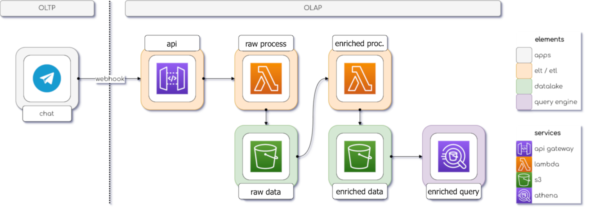

# Projeto-Análise-de-dados-Pipeline-de-dados-telegram

### ⚙️ Arquitetura do Projeto:


### 📋 Sobre o Projeto:
Nesse Projeto será construído um bot do Telegram com o objetivo de fazer um pipeline de dados com as conversas do Telegram, com intuito de simular um bot para ajudar o usuário com alguma dúvida, envolvendo etapas de ingestão de dados, ETL e apresentação no ambiente da Amazon Web Service.


### 💻 Ambientes utilizados:
<div>
 
 
</div>

### ⌨️ Linguagens utilizadas:
<div>
  
  
</div>


### ✅ Desenvolvimento:

* Criação de um bot de Telegram com o uso do botfather e configuração do bot para atender as necessidades do projeto.
* Retorno de funções Python em resposta a interação com o bot do Telegram.
* Captura das mensagens do bot e demais dados com o método `get`.
* Trabalho com três etapas no pipeline:
   * Ingestão
   * ETL
   * Apresentação
* Na etapa de Ingestão envolve coleta, transferência e armazenamento de dados.
   - Criar um *bucket* no `AWS S3`;
   - Criar uma função no `AWS Lambda`;
        - Definir variáveis de ambiente e permissões.
   - Criar uma API *web* no `AWS API Gateway`;
   - Configurar o *webhook* da API de *bots* do **Telegram**.
* Na etapa de ETL envolve extração e transformação dos dados para o usuário final.
   - Criar um *bucket* no `AWS S3` com sufixo `-enriched`;
   - Criar uma função no `AWS Lambda` com sufixo `-enriched`;
        - Definir variáveis de ambiente, permissões, recursos e camadas.
   - criar regra para ativar a funçõe de ETL do `AWS Lambda` no `AWS Event Bridge`;
        - Definir programação para execução da função.
* Por fim, na etapa de Apresentação usamos o `AWS Athena` para apresentar para o usuário final informações do bot por meio de consultas `SQL`.
   -  o `AWS Athena` tem função de entregar o dados através de uma interface `SQL` para os usuários do sistema analítico;
   -  Com o dado disponível, usuário podem executar as mais variadas consultas analíticas;

  
### 📥 Importações Python:

➮ **Google Colab**:

```
import os
import pandas as pd
import logging
import json
import requests
from getpass import getpass
import seaborn as sns

import pyarrow as pa
import pyarrow.parquet as pq

```
➮ **AWS Lambda**:

```
import os
import json
import logging
from datetime import datetime, timezone
import boto3
from datetime import datetime, timedelta, timezone
import pyarrow as pa
import pyarrow.parquet as pq

```
### 📎 Organização do Projeto:
------------


    ├── requirements.txt          <- O arquivo de requisitos para reproduzir o ambiente de análise, por exemplo, gerado com `pip congelamento > requisitos.txt
    │
    ├── LICENSE
    │
    ├── README.md                 <- O Readme de nível superior para desenvolvedores que usam esse projeto
    │
    ├── architecture.png          <- Arquitetura do projeto de Pipeline de dados   
    │
    ├── Query                     <- Referente as consultas SQL realizadas.
    │
    └──notebook                  <- caderno jupyter notebook utilizado para contrução e apresentação do projeto
    

--------
### 🌐 Referências:

✦ [ebac](https://ebaconline.com.br/)  ✦ [hashtag_programacao]((https://github.com/andre-marcos-perez/data-pipeline-demo))

